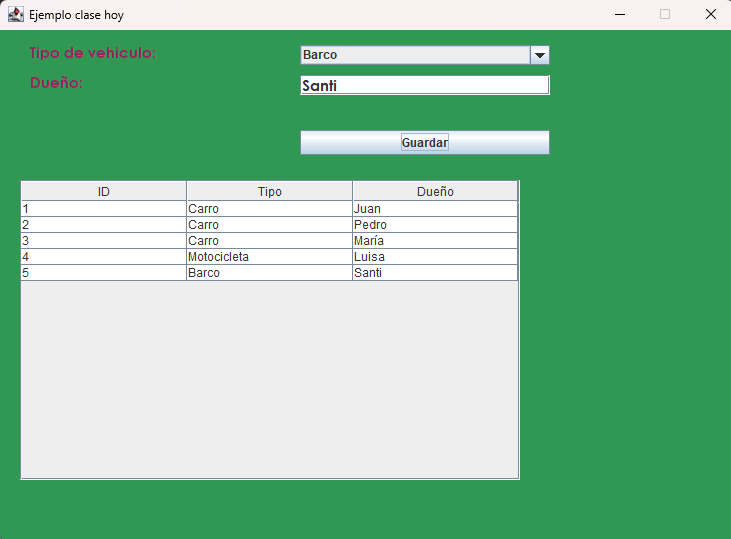

# 🧑‍💻 Interfaces Gráficas en JAVA

## 🌟Primeros pasos de AWT y Swing

_Fecha: 18-04-2026_

En esta clase se impartió las bases de creación de ventanas en java, creación de componentes como pestañas, campos de texto, labels y paneles utilizando las librerias de AWT y Swing.

### Contenido
- AWT
    - Color
    - ActionListener
- Swing
    - JFrame
    - JPanel
    - JLabel
    - JButton
    - JTable
    - JTabbedPane
    - JTextField
    - JPasswordField
	- JComboBox

### Material de Apoyo

Adjunto material de apoyo de Java para interfaces graficas, excepciones, I/O y Acceso de base de datos en el siguiente [link](./Material_Apoyo/)

#### 👤Contacto

Correo: [rodrialehdl@gmail.com](rodrialehdl@gmail.com)